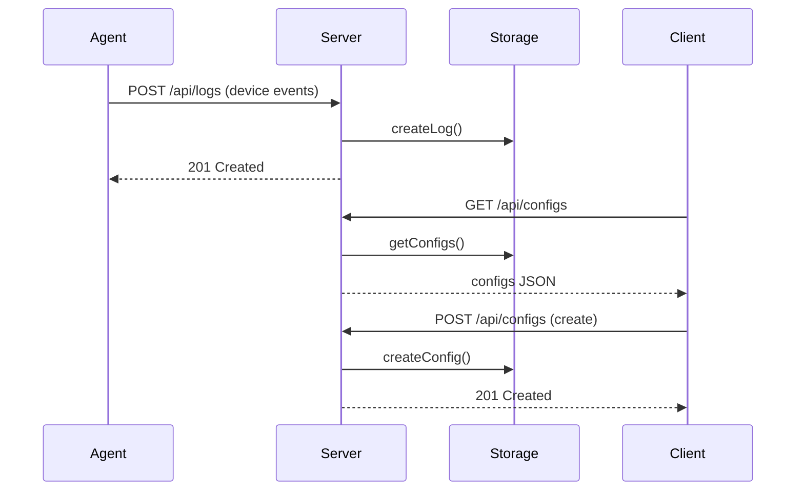

# Device-Sentinel Architecture

## Overview
Device-Sentinel collects USB/connectivity events from agents and stores logs and configurations on the server. The React client provides UI to create configs, view logs, and trigger actions.

## Key Components

- server/: Express API and static asset serving. Provides endpoints under `/api/*`.
- server/storage.ts: Data persistence. Uses Postgres via `drizzle-orm` when `DATABASE_URL` is set, otherwise falls back to a JSON file for local development.
- client/: React UI built with Vite and TanStack Query.
- shared/: TypeScript schema definitions and API route descriptions (Zod schemas).

## Sequence Diagram



## Data Flow

```mermaid
flowchart LR
    A[Device Agent] -->|POST /api/logs| B[Express API]
    B --> C[Storage layer (Postgres or JSON fallback)]
    C --> B
    D[React Client] -- fetch --> B
    D <-- render -- B
    B --> E[Agent Download Script]
```

## Local Development

1. Install dependencies:

```powershell
npm install
```

2. Start the server in development mode (uses `tsx` to run TypeScript):

```powershell
npm run dev
```

3. If you have a Postgres instance, set `DATABASE_URL` before starting the server. Otherwise the server will use a JSON fallback file at `data/fallback-db.json`.

4. Open the client UI (Vite) via the server dev setup (the repo ships with Vite integration in `server/vite.ts`).

## Notes
- Tests are scaffolded via `jest` in `package.json`. Install dev dependencies before running `npm test`.
- If you plan to deploy to production, ensure `DATABASE_URL` is set and a Postgres instance is available.
